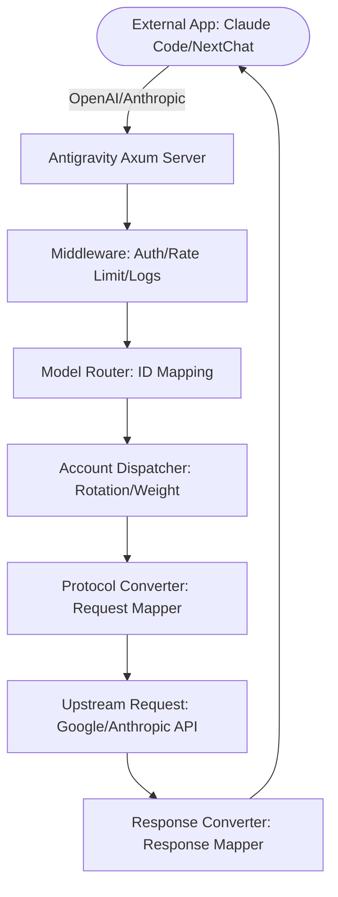

# Antigravity Tools 🚀
> Professional-grade AI Account Management & Protocol Proxy System (v4.2.2)

<div align="center">
  

  <h3>Your Personal High-Performance AI Dispatch Gateway</h3>
  <p>More than just account management—the ultimate solution to break down API invocation barriers.</p>
  
  <p>
    <a href="https://github.com/VarshuAi/Antigravity-Manager">
      
    </a>
    
    
    
    
  </p>

  <p>
    <a href="#-core-features">Core Features</a> • 
    <a href="#-gui-overview">GUI Overview</a> • 
    <a href="#-architecture">Architecture</a> • 
    <a href="#-installation">Installation</a> • 
    <a href="#-quick-start-integration">Quick Start</a>
  </p>

  <p>
    <a href="./README.md">简体中文</a> | 
    <strong>English</strong>
  </p>
</div>

---

**Antigravity Tools** is a full-featured desktop application designed for developers and AI enthusiasts. It seamlessly combines multi-account management, protocol translation, and intelligent request scheduling to provide you with a stable, high-speed, and low-cost **local AI translation hub**.

With this application, you can convert common Web-based sessions (Google/Anthropic) into standardized API endpoints, eliminating the protocol barriers between different providers.

---

## 💖 Sponsors

| Sponsor | Description |
| :---: | :--- |
|  | Thanks to **PackyCode** for sponsoring this project! PackyCode is a reliable and efficient API relay service provider, offering relays for Claude Code, Codex, Gemini, and other mainstream AI models. PackyCode offers a special benefit for our users: register using [this link](https://www.packyapi.com/register?aff=Ctrler), and enter the promo code **"Ctrler"** upon deposit to enjoy a **10% discount**. |
|  | Thanks to **Claude API** for supporting this project! claudeapi.com is a **Claude API** relay station utilizing official and AWS channels. It focuses specifically on Claude, featuring high stability and low latency with full support for Claude Code. Special benefit for our users: register via the [exclusive link](https://console.claudeapi.com/register?source=antigravity) to receive **free test credits**, and enjoy a **5% discount** on top-ups (contact customer service). |
|  | Thanks to **AICodeMirror** for sponsoring this project! AICodeMirror provides highly stable official relays for Claude Code / Codex / Gemini CLI, supporting enterprise-grade high concurrency, fast billing, and 24/7 dedicated support. Rates for official channels are as low as 3.8% to 0.9% of official pricing, with additional discounts for top-ups. Users registering through [this link](https://www.aicodemirror.com/register?invitecode=MV5XUM) can enjoy 20% off their first recharge, and enterprise customers can enjoy up to 25% off! |
|  | Thanks to **VisionCoder** for supporting this project. [VisionCoder Development Platform](https://coder.visioncoder.cn) is a reliable and efficient API relay service provider, offering mainstream AI models like Claude Code, Codex, and Gemini to help developers and teams easily integrate AI capabilities. Register through [this link](https://coder.visioncoder.cn) and purchase the [Token Plan](https://coder.visioncoder.cn) during the limited-time promotion to enjoy a **"Buy 1 Month, Get 1 Month Free"** benefit. |
|  | Thanks to **APIKEY.FUN** for sponsoring this project! APIKEY.FUN is a professional enterprise-level AI relay station dedicated to providing stable, high-efficiency, and low-cost API access for mainstream models like Claude, OpenAI, and Gemini. Pricing is as low as 7% of official rates. Register through this [exclusive link](https://apikey.fun/register?aff=Ctrler) to enjoy a **permanent 5% discount** on all top-ups. |

### ☕ Support the Project

If you find this project helpful, feel free to support the author!

<a href="https://www.buymeacoffee.com/Ctrler" target="_blank"></a>

| Alipay | WeChat Pay | Buy Me a Coffee |
| :---: | :---: | :---: |
|  |  |  |

---

## 🚀 Recommended Projects

If you like this project, you may also be interested in:
* **[Antigravity-Tools-LS](https://github.com/lbjlaq/Antigravity-Tools-LS)**: A Language Server Protocol (LSP) designed specifically for AI protocols, providing smart code completions, diagnostics, and protocol debugging.

---

## 🌟 Core Features

### 1. 🎛️ Smart Account Dashboard
* **Real-time Global Monitoring**: Instant insights into the health status of all accounts, including the **average remaining quota** for Gemini Pro, Gemini Flash, Claude, and Gemini Image.
* **Smart Recommendation**: Real-time algorithm calculates and selects the "best account" based on quota redundancy, supporting **one-click switching**.
* **Active Account Snapshot**: Visually displays the exact remaining quota percentage and last sync time for the currently active account.

### 2. 🔐 Powerful Account Manager
* **OAuth 2.0 Authorization (Auto/Manual)**: Generates authorization links that can be opened in any browser. The application automatically saves credentials upon successful callback.
* **Multi-dimensional Import**: Supports single Token input, bulk JSON import (such as backups from other tools), and automatic hot-migration from V1 legacy databases.
* **Gateway-level View**: Supports list and grid view switching. Built-in 403 ban detection automatically flags and skips accounts with permission anomalies.

### 3. 🔌 Protocol Translation & Relay (API Proxy)
* **Full Protocol Compatibility (Multi-Sink)**:
  - **OpenAI Format**: Provides a `/v1/chat/completions` endpoint compatible with 99% of existing AI applications.
  - **Anthropic Format**: Provides native `/v1/messages` endpoints, fully supporting **Claude Code CLI** features (including thinking chains and system prompts).
  - **Gemini Format**: Fully supports direct invocations via the official Google SDK.
* **Smart Status Self-healing**: Instantly triggers **auto-retry and silent rotation** (in milliseconds) when encountering `429 (Too Many Requests)` or `401 (Expired)` errors, ensuring zero business interruption.

### 4. 🔀 Model Router
* **Model Grouping & Mapping**: Map complex upstream model IDs into "specification families" (e.g., routing all GPT-4 requests to `gemini-3-pro-high`).
* **Expert Redirects**: Supports custom regex-based model mapping for precise control over where each request is processed.
* **Tiered Routing**: Dynamically prioritizes accounts by type (Ultra/Pro/Free) and quota reset frequencies. High-frequency resetting accounts are prioritized to guarantee service stability.
* **Silent Background Task Downgrade**: Automatically detects background requests generated by tools like Claude CLI (e.g., title generation) and redirects them to Flash models to protect premium quota.

### 5. 🎨 Multimodal & Imagen 3 Support
* **Advanced Quality Control**: Automatically maps standard OpenAI `size` parameters (e.g., `1024x1024`, `16:9`) to corresponding Imagen 3 dimensions.
* **High Payload Support**: Backends support up to **100MB** (configurable) payloads, easily handling 4K high-definition image recognition.

---

## 📸 GUI Overview

| | |
| :---: | :---: |
|  <br> Dashboard |  <br> Account List |
|  <br> About Page |  <br> API Proxy Settings |
|  <br> System Settings | |

### 💡 Usage Examples

| | |
| :---: | :---: |
|  <br> Claude Code Web Search |  <br> Cherry Studio Citation Integration |
|  <br> Imagen 3 Image Generation |  <br> Kilo Code Integration |

---

## 🏗️ Architecture



---

## 🏗️ Installation

### Option A: Terminal Installation (Recommended)

#### Cross-Platform One-Click Script
Automatically detects OS, architecture, and package managers to download and install.

**Linux / macOS:**
```bash
curl -fsSL https://raw.githubusercontent.com/lbjlaq/Antigravity-Manager/v4.2.2/install.sh | bash
```

**Windows (PowerShell):**
```powershell
irm https://raw.githubusercontent.com/lbjlaq/Antigravity-Manager/main/install.ps1 | iex
```

> **Supported Formats**: Linux (`.deb` / `.rpm` / `.AppImage`) | macOS (`.dmg`) | Windows (NSIS `.exe`)
>
> **Advanced Usage**: Pin specific version `curl -fsSL ... | bash -s -- --version 4.2.2` or dry-run `curl -fsSL ... | bash -s -- --dry-run`

#### macOS - Homebrew
If you have [Homebrew](https://brew.sh/) installed:
```bash
# 1. Tap the repository
brew tap lbjlaq/antigravity-manager https://github.com/lbjlaq/Antigravity-Manager

# 2. Install the app
brew install --cask antigravity-tools
```
> *Tip: Use `--no-quarantine` if you encounter macOS gatekeeper issues.*

#### Arch Linux
**Method 1: One-Click Script (Recommended)**
```bash
curl -sSL https://raw.githubusercontent.com/lbjlaq/Antigravity-Manager/main/deploy/arch/install.sh | bash
```
**Method 2: Via Homebrew**
```bash
brew tap lbjlaq/antigravity-manager https://github.com/lbjlaq/Antigravity-Manager
brew install --cask antigravity-tools
```

### Option B: Manual Download
Go to [GitHub Releases](https://github.com/VarshuAi/Antigravity-Manager/releases) and download the appropriate package:
* **macOS**: `.dmg` (Apple Silicon & Intel)
* **Windows**: `.msi` or portable `.zip`
* **Linux**: `.deb` or `.AppImage`

### Option C: Docker Deployment (Recommended for NAS/Servers)
For containerized deployment, we provide official Docker images with built-in Headless support. It automatically hosts frontend assets and allows web management.

```bash
# Method 1: Direct Run (Recommended)
# - API_KEY: Required. Used to authorize all proxy AI requests.
# - WEB_PASSWORD: Optional. Password for admin panel login. Defaults to API_KEY.
docker run -d --name antigravity-manager \
  -p 8045:8045 \
  -e API_KEY=sk-your-api-key \
  -e WEB_PASSWORD=your-login-password \
  -e ABV_MAX_BODY_SIZE=104857600 \
  -v ~/.antigravity_tools:/root/.antigravity_tools \
  lbjlaq/antigravity-manager:latest
```

#### 🔐 Authentication Logic
* **Scenario A: Only `API_KEY` is set**
  - **Web Login**: Access administrative dashboard using the `API_KEY`.
  - **API Calls**: Validate requests using the same `API_KEY`.
* **Scenario B: Both `API_KEY` and `WEB_PASSWORD` are set (Recommended)**
  - **Web Login**: Admin access **requires** the `WEB_PASSWORD` (safer).
  - **API Calls**: Authorized using the `API_KEY`.

> [!TIP]
> **Password Priority (Docker/Web)**:
> 1. **Highest Priority**: Environment variables `ABV_WEB_PASSWORD` or `WEB_PASSWORD`.
> 2. **Second Priority**: `admin_password` configured inside `gui_config.json`.
> 3. **Fallback**: Reverts to `API_KEY` if neither of the above is configured.

---

## 🛠️ Troubleshooting

### macOS says "App is damaged and can't be opened"?
Due to Gatekeeper security checks, apps downloaded outside the App Store might display this error. You can fix it with:

1. **Terminal Command** (Recommended):
   ```bash
   sudo xattr -rd com.apple.quarantine "/Applications/Antigravity Tools.app"
   ```
2. **Homebrew Option**:
   Install using `--no-quarantine` to automatically bypass this check:
   ```bash
   brew install --cask --no-quarantine antigravity-tools
   ```

---

## 🔌 Quick Start Integration

### 🔐 OAuth Flow (Adding Accounts)
1. Navigate to **Accounts** → **Add Account** → **OAuth**.
2. Click the link to copy the pre-generated authorization URL. Open it in your browser to complete authorization.
3. Once completed, your browser will display a Callback success message.
4. The desktop app will automatically sync and save your credentials. (Click **I have authorized, continue** if it doesn't automatically trigger).

### Integrating with Claude Code CLI
1. Start Antigravity and enable proxy services in the **API Proxy** settings.
2. Run in your terminal:
```bash
export ANTHROPIC_API_KEY="sk-antigravity"
export ANTHROPIC_BASE_URL="http://127.0.0.1:8045"
claude
```

### Integrating with Python SDK
```python
import openai

client = openai.OpenAI(
    api_key="sk-antigravity",
    base_url="http://127.0.0.1:8045/v1"
)

response = client.chat.completions.create(
    model="gemini-3-flash",
    messages=[{"role": "user", "content": "Hello! Introduce yourself."}]
)
print(response.choices[0].message.content)
```

### Image Generation (Imagen 3)

#### Method 1: OpenAI Images API
```python
import openai
import base64

client = openai.OpenAI(
    api_key="sk-antigravity",
    base_url="http://127.0.0.1:8045/v1"
)

response = client.images.generate(
    model="gemini-3-pro-image",
    prompt="A futuristic cyberpunk city with neon lights",
    size="1920x1080",      # Auto-maps to closest supported aspect ratio
    quality="hd",          # "standard" | "hd" | "medium"
    n=1,
    response_format="b64_json"
)

# Save image
image_data = base64.b64decode(response.data[0].b64_json)
with open("output.png", "wb") as f:
    f.write(image_data)
```

#### Method 2: Chat API Parameters
All chat protocols (OpenAI/Claude) support passing `size` and `quality` parameters directly to image models:
```python
response = client.chat.completions.create(
    model="gemini-3-pro-image",
    size="1920x1080",
    quality="hd",
    messages=[{"role": "user", "content": "A futuristic city"}]
)
```

---

Copyright © 2024-2026 [lbjlaq](https://github.com/lbjlaq)
